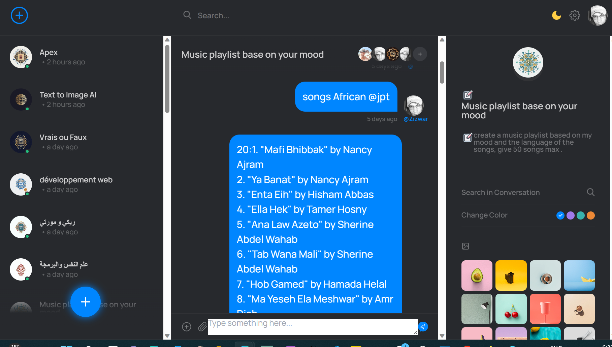

## `Roomy Prompt - ChatGPT Rooms`

A minimal chat platform template. It uses [Fresh](https://fresh.deno.dev) +
[Supabase](https://supabase.io) + [twind](https://twind.dev) +
[BroadcastChannel API](https://developer.mozilla.org/en-US/docs/Web/API/Broadcast_Channel_API) + [OpenAI API](https://oepnai.com)
on Deno Deploy.

To get started, setup your `.env` with Supabase and Github OAuth and Google OAuth and OpenAI credentials:

- `cp _env .env`

```
deno task start
```
## Acknowledgements

- The data structure was inspired by [Deno Chat](https://showcase-chat.deno.dev/).
- The chat design was adapted from [Messaging App UI](https://codepen.io/TurkAysenur/pen/ZEbXoRZ).

